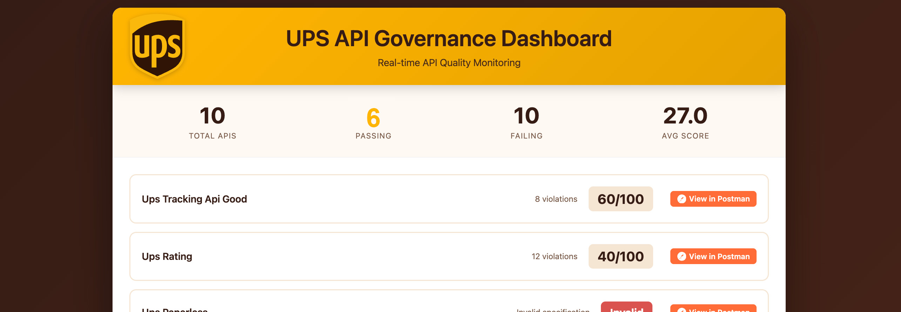

# UPS API Governance Demo



## Overview

**Reference implementation** of an automated API governance and dashboarding system that integrates **Postman Spec Hub**, **CI/CD pipelines** (Azure DevOps or GitHub Actions), and **Microsoft Teams notifications**. Demonstrates transformation of API governance from "3 days of review" to "automatic quality gate in 20 minutes" using real UPS API specifications. Spectral rules are default, so scoring accuracy isn't really indicative of actual governance criteria.

All components tested end-to-end with real data.

**Public Workspace**: https://www.postman.com/r00tfs/ups-governance-demo/overview

## Project Structure

```
ups-governance-demo/
├── .azure/pipelines/
│   └── postman-governance.yml        # Azure DevOps CI/CD pipeline
├── .github/workflows/
│   └── postman-governance.yml        # GitHub Actions workflow
├── api-specs/                        # Real UPS API specifications (YAML)
│   ├── Tracking.yaml                 # Official UPS Tracking API
│   ├── Shipping.yaml                 # Official UPS Shipping API  
│   ├── DangerousGoods-Ready.yaml     # Official UPS Dangerous Goods API
│   ├── ups-rating.yaml               # Official UPS Rating API
│   ├── ups-address-validation.yaml   # Official UPS Address API
│   ├── ups-locator.yaml              # Official UPS Locator API
│   ├── ups-paperless.yaml            # Official UPS Paperless API
│   ├── ups-tracking-api-bad.yaml     # Demo: Low-quality spec (12/100)
│   ├── ups-tracking-api-good.yaml    # Demo: High-quality spec (60/100)
│   └── ups-tracking-api-improved.yaml # Demo: Improved spec (75/100)
├── scripts/                          # Governance automation
│   ├── ups_postman_governance.js     # Dynamic governance scorer with API integration
│   ├── teams_notifier.js             # Teams notification system  
│   └── upload_specs_to_postman.js    # Postman Specs Hub manager with collection generation
├── SETUP-AZURE-VARIABLES.md          # Azure DevOps configuration guide
├── SETUP-GITHUB-VARIABLES.md         # GitHub Actions configuration guide
├── SETUP-TEAMS-WEBHOOK.md            # Teams webhook setup guide
├── .env.example                      # Environment variable template
├── package.json                      # Node.js dependencies
└── governance-dashboard.html         # Generated governance dashboard
```

## Quick Start

### 1. Prerequisites
- Node.js 20+ (LTS recommended)
- [Postman CLI](https://learning.postman.com/docs/postman-cli/postman-cli-overview/) installed
- Azure DevOps or GitHub account (for CI/CD, optional)
- Microsoft Teams webhook (optional)

### 2. Environment Setup
```bash
# Copy environment template
cp .env.example .env

# Edit .env with your credentials
POSTMAN_API_KEY="your-postman-api-key"
UPS_WORKSPACE_ID="your-workspace-id" 
TEAMS_WEBHOOK_URL="your-teams-webhook-url"
```

### 3. Install Dependencies  
```bash
npm install
```

### 4. Login to Postman
```bash
postman login --with-api-key $POSTMAN_API_KEY
```

### 5. Quick Demo (Optional)
```bash
# Run the automated demo script
./demo.sh

# Or use npm shortcut to generate dashboard immediately
npm run dashboard
```

##  30-Second Quick Start

```bash
# 1. Set environment variables
export POSTMAN_API_KEY="your-postman-api-key"
export UPS_WORKSPACE_ID="your-workspace-id"

# 2. Install and run
npm install
npm run dashboard

# 3. Open governance-dashboard.html in your browser
```

**That's it!** You now have a live governance dashboard pulling from your Postman workspace.

## Core Features

### Dynamic API Discovery

The governance dashboard automatically discovers and scores all specs in a Postman workspace:
- Real-time fetching from Postman API
- Always up-to-date, triggers on pipeline run
- Automatically updates the dashboard, which can be published as a pipeline artifact

### Postman Specs Hub Integration

Upload and manage OpenAPI specifications in Postman's Spec Hub with automatic collection generation:

```bash
# Upload single spec
node scripts/upload_specs_to_postman.js upload api-specs/Tracking.yaml

# Upload single spec with collection generation
node scripts/upload_specs_to_postman.js upload api-specs/Tracking.yaml --with-collections

# Upload all specs  
node scripts/upload_specs_to_postman.js upload-all

# Upload all specs with collection generation
node scripts/upload_specs_to_postman.js upload-all --with-collections

# Re-upload all specs (idempotent - deletes existing first)
node scripts/upload_specs_to_postman.js reupload-all

# Upload demo specs only
node scripts/upload_specs_to_postman.js upload-demo

# List specs in workspace
node scripts/upload_specs_to_postman.js list

# Re-upload (delete and recreate)
node scripts/upload_specs_to_postman.js reupload api-specs/Tracking.yaml

# Re-upload with collection generation
node scripts/upload_specs_to_postman.js reupload api-specs/Tracking.yaml --with-collections

# Generate collection from existing spec
node scripts/upload_specs_to_postman.js generate-collection <spec-id>

# Generate collections for all specs
node scripts/upload_specs_to_postman.js generate-all-collections
```

### API Governance Scoring

Scores APIs using Postman's native governance linting; currently uses default Spectral ruleset, but can be customized -- as can the scoring algorithm. The dashboard automatically fetches all specs from the Postman workspace:

```bash
# Generate HTML dashboard (automatically fetches all specs from Postman API)
node scripts/ups_postman_governance.js --workspace $UPS_WORKSPACE_ID --output governance-dashboard.html

# Score entire workspace (JSON output)
node scripts/ups_postman_governance.js --workspace $UPS_WORKSPACE_ID --json

# Score specific spec
node scripts/ups_postman_governance.js --spec <spec-id> --json

# Set custom threshold
node scripts/ups_postman_governance.js --workspace $UPS_WORKSPACE_ID --threshold 80
```

**Dynamic Dashboard Generation:**
- Automatically discovers all specs in your Postman workspace
- Fetches real-time data directly from Postman API
- No need to maintain local spec lists
- Always shows current state of your API specifications

**Demo Scoring Algorithm:**
- **ERROR violations**: -10 points each
- **WARNING violations**: -5 points each  
- **INFO violations**: -2 points each
- **HINT violations**: -1 point each
- **Starting score**: 100 points
- **Pass threshold**: 70/100 (configurable)

## Configuring Custom Governance Rules

This demo uses Postman's native governance capabilities. To customize the scoring rules for your organization:

### 1. Access Postman Governance
1. Open Postman and navigate to your team workspace
2. Go to **Home** → **API Governance** in the team information pane
3. Click **Create Rule** to define custom rules

### 2. Create Custom Rules (Examples)

**Example 1: Require Operation Descriptions**
```yaml
rules:
  operation-description-required:
    description: "All operations must have descriptions"
    message: "Operation {{path}} {{method}} is missing a description"
    severity: error
    formats:
      - oas3
      - oas2  
    given: "$.paths.*[get,post,put,patch,delete]"
    then:
      field: description
      function: truthy
```

**Example 2: Enforce Contact Information**
```yaml
rules:
  api-contact-info:
    description: "API must have contact information"
    message: "API specification must include contact information"
    severity: warning
    given: "$.info"
    then:
      field: contact
      function: truthy
```

**Example 3: UPS-Specific Naming Convention**
```yaml
rules:
  ups-operation-naming:
    description: "Operation IDs should follow UPS naming convention"
    message: "Operation ID should start with ups or UPS"
    severity: info
    given: "$.paths.*.*.operationId"
    then:
      function: pattern
      functionOptions:
        match: "^(ups|UPS)[A-Z].*"
```

### 3. Activate Rules in Your Workspace
1. After creating rules, toggle them **ON** in the Custom Rules section
2. Add rules to your **workspace group** to enforce across all APIs
3. Rules will automatically apply to all specs in the workspace

### 4. Test Your Rules
```bash
# Score a specific spec with your custom rules
postman spec lint <spec-id> --output json

# Or use the dashboard (automatically picks up workspace rules)
npm run dashboard
```

### 5. Integration with CI/CD
Your Azure DevOps pipeline automatically uses the workspace's governance rules:
- Rules are fetched from your Postman workspace
- No additional configuration needed in the pipeline
- Custom rules affect the governance scores in real-time

### Rule Severity Levels
- **error**: Blocks pipeline (recommended for critical standards)
- **warning**: Reduces score but doesn't block
- **info**: Minor score reduction
- **hint**: Minimal impact, mostly informational

**Full Documentation**: [Postman API Governance Rules](https://learning.postman.com/docs/api-governance/configurable-rules/)

## Advanced Configuration

### Environment Variables

All configuration can be managed through environment variables:

```bash
# Required
POSTMAN_API_KEY=your-postman-api-key
UPS_WORKSPACE_ID=your-workspace-id

# Optional
TEAMS_WEBHOOK_URL=your-teams-webhook-url
GOVERNANCE_THRESHOLD=70  # Custom threshold (0-100)
```

### Custom Governance Thresholds

The governance threshold can be customized at multiple levels:

```bash
# 1. Environment variable (affects all runs)
export GOVERNANCE_THRESHOLD=80

# 2. Per-script execution  
node scripts/ups_postman_governance.js --workspace $UPS_WORKSPACE_ID --threshold 85

# 3. Pipeline manual trigger
# Azure DevOps: Select from dropdown (50/60/70/80/90)
# GitHub Actions: Choose in workflow_dispatch input
```

### Collection Generation Options

Generate Postman collections automatically from your API specs:

```bash
# Upload specs with automatic collection generation
node scripts/upload_specs_to_postman.js upload-all --with-collections

# Generate collections for all existing specs
node scripts/upload_specs_to_postman.js generate-all-collections

# Upload single spec with collection
node scripts/upload_specs_to_postman.js upload api-specs/Tracking.yaml --with-collections
```

### Pipeline Customization

#### Node.js Version
Both pipelines use Node.js 20.x LTS. To change:
- **GitHub Actions**: Modify `node-version: '20.x'` in `.github/workflows/postman-governance.yml`
- **Azure DevOps**: Modify `versionSpec: '20.x'` in `.azure/pipelines/postman-governance.yml`

#### Artifact Retention
- **GitHub Actions**: Change `retention-days: 30` in upload-artifact steps
- **Azure DevOps**: Artifacts retained per project settings

#### Cache Behavior
- **NPM Dependencies**: Automatically cached based on `package-lock.json`
- **Custom Cache Keys**: Modify cache key patterns in pipeline files

### NPM Scripts

Available shortcuts for local development:

```bash
npm run dashboard    # Generate governance dashboard  
npm run score        # Run governance scoring
npm run notify       # Send Teams notification
npm run update-specs # Update spec-ids.json from workspace
npm run test         # Show help information
```

### Error Handling & Retry Logic

The system includes built-in resilience features:

- **Retry Logic**: Automatic retry with exponential backoff for network failures
- **Rate Limiting**: Built-in delays between API requests to respect Postman limits
- **Partial Failures**: Spec upload failures don't block governance checks
- **Graceful Degradation**: Individual spec failures don't stop batch processing

### Teams Notifications

Send governance alerts to Microsoft Teams:

```bash
# Single API notification
node scripts/teams_notifier.js \
  --api "UPS Tracking API" \
  --score 85 \
  --violations 3 \
  --link "https://[team].postman.co/workspace/your-workspace"

# Batch summary from governance report
node scripts/teams_notifier.js --batch governance-report.json
```

The Teams notifier automatically detects build context from environment variables:
- `USER` / `BUILD_REQUESTEDFOR`: Submitter information
- `BUILD_URL` / `SYSTEM_TEAMFOUNDATIONCOLLECTIONURI`: Build links

## Troubleshooting

### Common Issues

**Governance Scores Show as 0/Invalid:**
- Verify `POSTMAN_API_KEY` is valid and has workspace access
- Check spec IDs are correct with `node scripts/upload_specs_to_postman.js list`  
- Ensure specs are valid OpenAPI 3.0 format

**Pipeline Failures:**
- **Azure DevOps**: Verify variable group name is exactly `postman-secrets`
- **GitHub Actions**: Check repository secrets are correctly named
- **Permission Issues**: Ensure service accounts have workspace access

**Teams Integration:**
- **No Cards Appearing**: Check webhook URL hasn't expired
- **Test Webhook**: `curl -X POST -H "Content-Type: application/json" -d '{"text":"Test"}' $TEAMS_WEBHOOK_URL`
- **Channel Settings**: Ensure channel allows external webhooks

**Rate Limiting:**
- Scripts automatically handle Postman API limits with delays
- For large workspaces (>50 specs), allow extra time for processing
- Network failures trigger automatic retry with backoff

### Performance Tuning

- **Large Workspaces**: Consider parallel processing for >20 specs
- **CI/CD Speed**: Enable NPM caching (already configured)
- **Build Times**: Pipeline typically completes in 2-5 minutes


## Real Demo Results

**Live governance scores from actual UPS APIs:**

View all specifications in the public workspace: https://www.postman.com/r00tfs/ups-governance-demo/overview

| API Specification | Score | Violations | Status | Issues |
|-------------------|-------|------------|---------|---------|
| UPS Tracking (Official) | 0/100 | Parse Error | FAIL | Complex YAML structure |  
| UPS Tracking (Demo Good) | 60/100 | 8 warnings | FAIL | Missing $ref properties |
| UPS Tracking (Demo Bad) | 12/100 | 47 violations | FAIL | Missing descriptions, inconsistent naming |

## Setup Guides

### CI/CD Platform Setup

Choose your preferred CI/CD platform:

#### Azure DevOps

See **[SETUP-AZURE-VARIABLES.md](SETUP-AZURE-VARIABLES.md)** for Azure DevOps setup:
- Creating Azure DevOps project
- Setting up the pipeline from YAML  
- Configuring variable groups
- Running your first governance pipeline

#### GitHub Actions

See **[SETUP-GITHUB-VARIABLES.md](SETUP-GITHUB-VARIABLES.md)** for GitHub Actions setup:
- Forking or creating repository
- Configuring repository secrets
- Running workflows manually or automatically
- Viewing results and artifacts

**Required Secrets/Variables (both platforms):**
- `POSTMAN_API_KEY` (secret)
- `UPS_WORKSPACE_ID`  
- `TEAMS_WEBHOOK_URL` (secret, optional)

### Teams Integration

See **[SETUP-TEAMS-WEBHOOK.md](SETUP-TEAMS-WEBHOOK.md)** for step-by-step Teams webhook setup.

## CI/CD Pipelines

Both Azure DevOps and GitHub Actions pipelines automatically:

1. **Set up Node.js 20 LTS** on Ubuntu 22.04
2. **Install** Postman CLI and jq for JSON processing
3. **Cache** NPM dependencies for faster builds
4. **Re-upload** specs to Spec Hub (idempotent - removes duplicates)
5. **Discover** all specs in workspace via Postman API
6. **Lint** specifications using Postman CLI with JSON output
7. **Calculate** quality scores for each API
8. **Block** merges if APIs score below threshold (enforced)
9. **Generate** dynamic governance dashboard as artifact
10. **Send** Teams notification with results (if webhook configured)
11. **Post** results as PR comments with links to Postman
12. **Create** job summaries with markdown reports

**Configuration:**
- **OS**: Ubuntu 22.04
- **Node.js**: Version 20 LTS
- **Manual triggers**: Support parameterized thresholds (50/60/70/80/90)

**Triggers:**
- Push to `main` or `feature/*` branches
- Changes to `api-specs/*` files
- Pull requests to `main` branch
- Manual workflow dispatch

## Teams Notifications

Adaptive cards include:

- **Quality Score** (0-100)
- **Violation Count** with severity breakdown
- **Pass/Fail Status** based on threshold  
- **Direct Links** to Postman workspace
- **Timestamp** and submitter information
- **Action Buttons** for review workflow

## Demo Scenarios

### Live Demo Flow

**Demonstrates**: "Developer submits API spec → Auto-scored → Quality gate blocks bad specs → Teams notifications → Governance team reviews only clean specs"

1. **Upload Bad API** (12/100):
   ```bash
   node scripts/upload_specs_to_postman.js upload api-specs/ups-tracking-api-bad.yaml
   ```

2. **Score and Alert**:
   ```bash  
   node scripts/ups_postman_governance.js --workspace $UPS_WORKSPACE_ID --json
   # Result: FAIL - 47 violations, blocks pipeline
   ```

3. **Teams Notification**:
   ```bash
   node scripts/teams_notifier.js --webhook "$TEAMS_WEBHOOK_URL" --api "Bad API" --score 12 --violations 47
   ```

4. **Upload Improved API** (75/100):
   ```bash
   node scripts/upload_specs_to_postman.js upload api-specs/ups-tracking-api-improved.yaml  
   # Result: PASS - Ready for governance review
   ```

## Demo Resources

### Quick Demo Script
```bash
# Automated demo for presentations
./demo.sh
```

### Key Files
- **demo.sh** - Automated demo script with pause points
- **DEMO.md** - Quick reference for manual demo steps  
- **.env.example** - Template for environment variables
- **governance-dashboard.html** - Generated dashboard (git-ignored except this one)

### NPM Scripts
```bash
npm run test       # Show help
npm run score      # Run governance scoring
npm run dashboard  # Generate governance dashboard
npm run notify     # Send Teams notification
```

## Reference API Specifications

Official UPS APIs (From [GitHub](https://github.com/UPS-API/api-documentation))